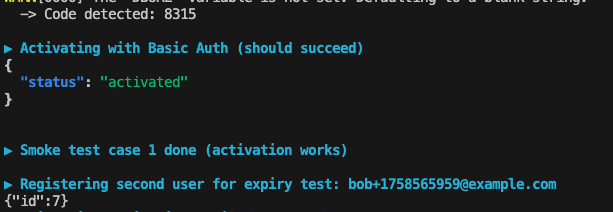
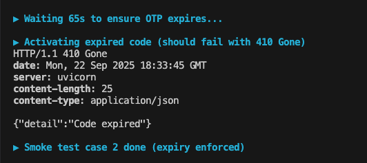

NB: This project was developed alongside a full-time on-site role. I did my best with the limited time available on weekends.

## Project Overview

A containerized micro-service implementing user registration and activation.
Users register with email + password, receive a 4-digit code via email, and activate their account within 1 minute using Basic Auth.

## Requirements

- [Docker](https://www.docker.com/)
- [Docker Compose](https://docs.docker.com/compose/)

## Start the project

```
./run.sh

```

This will:

- Build the FastAPI app and SMTP mock
- Start the full stack with Docker Compose
- Wait for services to be healthy

## Launch the project with smoke testing

To verify the full flow automatically (register, send code, activate) for 2 cases (expired code and expired code):

```
./run_and_smoke_testing.sh

```

This will:

Register a test user

Send a 4-digit code via the mock SMTP

Activate the user via Basic Auth

Run an expiration test after 60 seconds


Auth API swagger: http://0.0.0.0:8000/docs#/

## Tech Stack

### Backend

- **FastAPI** — main web framework
- **Pydantic** — data validation and serialization
- **argon2-cffi** — secure password hashing and OTP verification

### Database

- **PostgreSQL 16**
- **psycopg3** — low-level PostgreSQL driver (no ORM)
- **psycopg-pool**

### External Services

- **SMTP Mock** — fake email service (HTTP API)
- **httpx** — async HTTP client used to call SMTP mock

### Dev & Packaging

- **Poetry** — dependency and packaging manager
- **Docker / Docker Compose** — container orchestration
- **Pytest** - For unit testing

## PostgreSQL Table Schemas

### `users` Table

Stores registered users.

| Column          | Type        | Description                                       |
| --------------- | ----------- | ------------------------------------------------- |
| `id`            | BIGSERIAL   | Primary key                                       |
| `email`         | CITEXT      | Unique, case-insensitive email (NOT NULL)         |
| `password_hash` | TEXT        | Hashed password (NOT NULL)                        |
| `is_active`     | BOOLEAN     | Whether the account is activated (default: false) |
| `created_at`    | TIMESTAMPTZ | Timestamp of user creation (default: now())       |
| `updated_at`    | TIMESTAMPTZ | Timestamp of last update (default: now())         |

---

### `activation_tokens` Table

Stores one activation token (hashed) per user.

| Column        | Type        | Description                                      |
| ------------- | ----------- | ------------------------------------------------ |
| `id`          | BIGSERIAL   | Primary key                                      |
| `user_id`     | BIGINT      | Foreign key → `users(id)`, **ON DELETE CASCADE** |
| `code_hash`   | TEXT        | Argon2 hash of the 4-digit OTP (NOT NULL)        |
| `created_at`  | TIMESTAMPTZ | When the token was created (default: now())      |
| `expires_at`  | TIMESTAMPTZ | Expiration timestamp (NOT NULL)                  |
| `consumed_at` | TIMESTAMPTZ | When the token was used (nullable)               |

## project layout

```
.
├── app/
│ ├── api/
│ │ ├── routers/ # endpoints
│ │ └── schemas/ # Pydantic models
│ ├── core/ # config, security, exceptions
│ ├── domain/
│ │ ├── entities/ # Business entities (User, ActivationToken)
│ │ ├── interfaces/ # Abstract contracts (UserRepo, TokenRepo, Mailer)
│ │ └── services/ # Business services (RegistrationService, ActivationService)
│ ├── infrastructure/ # Technical implementations (adapters)
│ │ ├── db/ # Postgres repositories (UserRepoPg, TokenRepoPg)
│ │ └── smtp/ # SMTP client (SmtpMailer)
│ └── main.py # entrypoint
├── migrations/ # SQL migrations
├── smtp-mock/ # Fake SMTP server
├── docker-compose.yml
├── Dockerfile
├── pyproject.toml # Poetry dependencies
├── poetry.lock
├── run.sh
├── run_and_smoke_testing.sh
└── README.md
```

## Sequences Diagrams (3 cases)

### Case 1: everything is OK

```
sequenceDiagram
  participant C as Client
  participant A as FastAPI
  participant DB as PostgreSQL
  participant S as SMTP Mock
  participant V as Argon2

  C->>A: POST /users {email, password}
  A->>DB: INSERT INTO users
  A->>V: Generate + hash OTP
  A->>DB: INSERT INTO activation_tokens (code_hash, ttl=60s)
  A->>S: POST /send {to, code}
  A-->>C: {id, status: "sent"}

  C->>A: POST /auth/activate (BasicAuth email:password, body: code)
  A->>DB: SELECT latest token for user
  A->>A: Check token.expires_at > now()
  A->>V: Argon2 verify(code_hash, code)
  A->>DB: UPDATE users SET is_active = true
  A-->>C: {status: "activated"}

```

### Case 2: user enter an expired code (>60s)

```
sequenceDiagram
  participant C as Client
  participant A as FastAPI
  participant DB as PostgreSQL

  C->>A: POST /auth/activate (BasicAuth email:password, body: code)
  A->>DB: SELECT latest token for user
  A->>A: Check token.expires_at < now()
  A-->>C: 410 Gone {"detail": "Code expired"}
```



### Case 3: user enter a wrong code

```
sequenceDiagram
  participant C as Client
  participant A as FastAPI
  participant DB as PostgreSQL
  participant V as Argon2

  C->>A: POST /auth/activate (BasicAuth email:password, body: wrong_code)
  A->>DB: SELECT latest token for user
  A->>V: Argon2 verify(code_hash, wrong_code)
  V-->>A: InvalidSignatureError
  A-->>C: 400 Bad Request {"detail": "Invalid code"}
```



## TODO

- Unit testing
- architecture schemas
- Makefile over .sh
