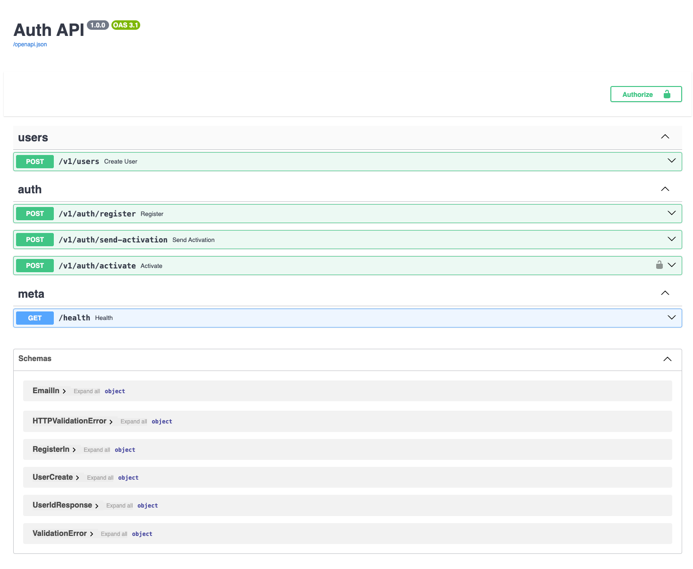

## Project Overview

A containerized micro-service implementing user registration and activation.
Users register with email + password, receive a 4-digit code via email, and activate their account within 1 minute using Basic Auth.

## Run the project

## Requirements

- [Docker](https://www.docker.com/)
- [Docker Compose](https://docs.docker.com/compose/)

## Start the project

```
./run.sh

```

This will:

- Build the FastAPI app and SMTP mock
- Start the full stack with Docker Compose
- Wait for services to be healthy

## Launch the project with smoke testing

To verify the full flow automatically (register, send code, activate) for 2 cases (expired code and expired code):

```
./run_and_smoke_testing.sh

```

This will:

Register a test user

Send a 4-digit code via the mock SMTP

Activate the user via Basic Auth

Run an expiration test after 60 seconds



Auth API swagger: http://0.0.0.0:8000/docs#/

## Tech Stack

### Backend

- **FastAPI** — main web framework
- **Pydantic** — data validation and serialization
- **argon2-cffi** — secure password hashing and OTP verification

### Database

- **PostgreSQL 16**
- **psycopg3** — low-level PostgreSQL driver (no ORM)

### External Services

- **SMTP Mock** — fake email service (HTTP API)
- **httpx** — async HTTP client used to call SMTP mock

### Dev & Packaging

- **Poetry** — dependency and packaging manager
- **Docker / Docker Compose** — container orchestration
- **Pytest** - For unit testing

## PSQL tables schemas:

`users` Table

Stores registered users.

| Column          | Type        | Description                      |
| --------------- | ----------- | -------------------------------- |
| `id`            | BIGSERIAL   | Primary key                      |
| `email`         | CITEXT      | Unique, case-insensitive email   |
| `password_hash` | TEXT        | Hashed password                  |
| `is_active`     | BOOLEAN     | Whether the account is activated |
| `created_at`    | TIMESTAMPTZ | Timestamp of user creation       |
| `updated_at`    | TIMESTAMPTZ | Timestamp of last update         |

`activation_tokens` Table

Stores 4-digit activation tokens (hashed) linked to users.

| Column        | Type        | Description                        |
| ------------- | ----------- | ---------------------------------- |
| `id`          | BIGSERIAL   | Primary key                        |
| `user_id`     | BIGINT      | Foreign key → `users(id)`          |
| `code_hash`   | TEXT        | Argon2 hash of the 4-digit OTP     |
| `created_at`  | TIMESTAMPTZ | When the token was created         |
| `expires_at`  | TIMESTAMPTZ | Expiration timestamp               |
| `consumed_at` | TIMESTAMPTZ | When the token was used (nullable) |

## project layout

```
.
├── app/                  # FastAPI source
│   ├── routers/          # Routers: auth, users
│   ├── crud/             # Repos: users_repo, tokens_repo
│   ├── services/         # smtp_client (3rd-party mock)
│   ├── core/security.py  # Argon2id + OTP
│   ├── db/cursor.py      # psycopg3 connection
│   └── main.py           # FastAPI entrypoint
├── migrations/           # SQL migrations
│   └── 001_init.up.sql
├── smtp-mock/            # Fake SMTP server (logs code)
│   ├── main.py
│   └── Dockerfile
├── docker-compose.yml
├── Dockerfile            # FastAPI app
├── pyproject.toml
├── poetry.lock
├── run.sh                # Orchestration + smoke test
└── README.md
```

## Sequences Diagrams (3 cases)

### Case 1: everything is OK

```
sequenceDiagram
  participant C as Client
  participant A as FastAPI
  participant DB as PostgreSQL
  participant S as SMTP Mock
  participant V as Argon2

  C->>A: POST /v1/auth/register {email, password}
  A->>DB: INSERT INTO users
  A-->>C: {id}

  C->>A: POST /v1/auth/send-activation {email}
  A->>DB: DELETE existing tokens
  A->>V: Hash OTP code with Argon2
  A->>DB: INSERT INTO activation_tokens (code_hash, ttl=60s)
  A->>S: POST /send {to, code}
  A-->>C: {status: "sent"}

  C->>A: POST /v1/auth/activate (BasicAuth email:code)
  A->>DB: SELECT latest token for user
  A->>A: Check token.expires_at > now()
  A->>V: Argon2 verify(code_hash, code)
  A->>DB: UPDATE users SET is_active = true
  A-->>C: {status: "activated"}
```

### Case 1: user enter an expired code (>60s)

```
sequenceDiagram
  participant C as Client
  participant A as FastAPI
  participant DB as PostgreSQL

  C->>A: POST /v1/auth/activate (BasicAuth email:code)
  A->>DB: SELECT latest token for user
  A->>A: Check token.expires_at < now()
  A-->>C: 410 Gone {"detail": "Code expired"}
```

### Case 2: user enter a wrong code

```
sequenceDiagram
  participant C as Client
  participant A as FastAPI
  participant DB as PostgreSQL
  participant V as Argon2

  C->>A: POST /v1/auth/activate (BasicAuth email:wrong_code)
  A->>DB: SELECT latest token for user
  A->>V: Argon2 verify(code_hash, wrong_code)
  V-->>A: InvalidSignatureError
  A-->>C: 401 Unauthorized {"detail": "Invalid credentials"}
```

## To Do:

- Continue unit testing (only 3 atm)
